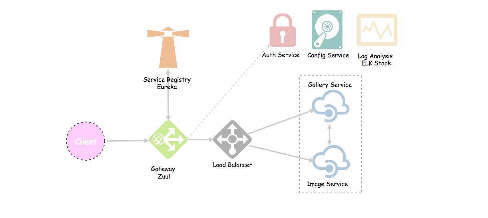

## Assamamulaikum 🌝

## Microservices
The term "Microservice Architecture" has sprung up over the last few years to describe a particular way of designing software applications as suites of independently deployable services. While there is no precise definition of this architectural style, there are certain common characteristics around organization around business capability, automated deployment, intelligence in the endpoints, and decentralized control of languages and data. - [Martin Fowler](https://martinfowler.com/articles/microservices.html)

## TODOS

[ x ] Service Discovery

[ x ] APi Gateway

[ x ] Sample REST Services

[ ] AUTH 

[ ] Circuit Breakers

[ ] Monitoring with Sleuth and Zipkin

[ ] Testing

[ ] CI/CD

## Example Design



by [OMAR ELGABRY](https://medium.com/@OmarElGabry)

## API Gateway / Reverse Proxy
cd api-gateway
```
mvn clean spring-boot:run
```

## Discovery Service
cd service-discovery
```
mvn clean spring-boot:run
```
go to localhost:8761, Instances currently services registered with Eureka

## Avaible Service
- TUK Management
    - goto http://localhost:8080/api/management/swagger-ui.html, to view avaible API for services


## References
- [https://martinfowler.com/articles/microservices.html]()
- [Microservices with spring boot](https://medium.com/omarelgabrys-blog/microservices-with-spring-boot-intro-to-microservices-part-1-c0d24cd422c3)

## Tools